```{r, include = FALSE}
knitr::opts_chunk$set(
  collapse = TRUE,
  comment = "#>"
)
```

## METABOX 2.0 GUI

Metabox 2.0 GUI runs in a web browser and provides interactive data analysis and visualization through a user-friendly interface. It is designed for users with little or no experience in R programming. Below are alternative ways to use the Metabox 2.0 GUI:

#### ***Use Metabox 2.0 as an R package***
  * Install Metabox 2.0 as a standard R package, see [details](https://github.com/kwanjeeraw/metabox2?tab=readme-ov-file#install-as-a-standard-r-package)
  * Open R or RStudio, then load the Metabox2 package and launch the GUI using the following R commands
 
 ```
 ##### INITIALIZATION #####
 library(metabox2) #load the package
 launch_gui()
 ```
 
#### ***Use Metabox 2.0 with Docker***
 * Install Metabox 2.0 via Docker, see [details](https://github.com/kwanjeeraw/metabox2?tab=readme-ov-file#use-gui-version-from-docker) 
 * Open a terminal:
    - Windows: Command Prompt or PowerShell
    - macOS / Linux: Terminal
 * Then load the GUI using the following commands
 
  ```
  cd [go to Dockerfile location]
  docker build --no-cache=true --platform linux/x86_64 -t metaboxweb .
  docker run --name mbdocker -p 8081:3838 metaboxweb
 ```
 * Next, navigate to http://localhost:8081/metaboxweb

#### ***Use Metabox 2.0 via the online server***
  * Access the [online server](https://github.com/kwanjeeraw/metabox2?tab=readme-ov-file#use-an-online-version-from-our-servers)

## CONTENTS

This tutorial shows how to use the Metabox 2.0 GUI across five modules. Figure 1 provides an overview of the pipeline.

```{r, echo=FALSE, results='asis'}
cat('
<p align="center">
  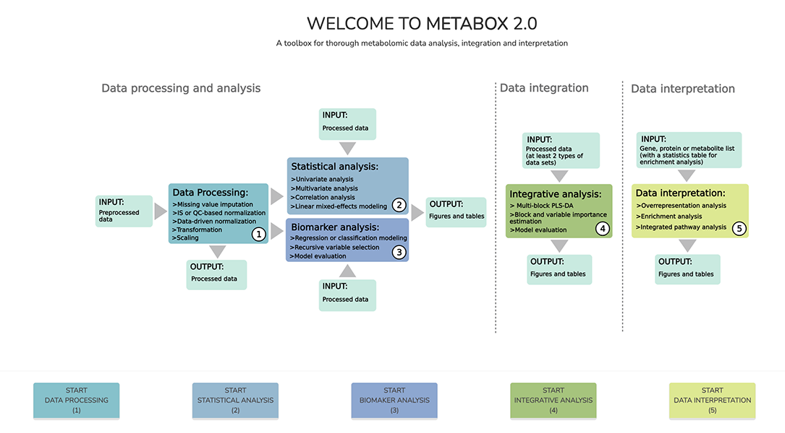<br>
  <em>Figure 1. Overview of Metabox 2.0 GUI containing three key pipelines and five modules</em>
</p>
')
```

Go to module:

  * [DATA PROCESSING](#module-1-data-processing)
  * [STATISTICAL ANALYSIS](#module-2-statistical-analysis)
  * [BIOMARKER ANALYSIS](#module-3-biomarker-analysis)
  * [INTEGRATIVE ANALYSIS](#module-4-integrative-analysis)
  * [DATA INTERPRETATION](#module-5-data-interpretation)

## PREPARE INPUT DATA

The input dataset should be a CSV table containing metadata columns along with feature variables, as illustrated in Table 1. Samples are in rows, and variables (features) are in columns. Experimental information—such as batch, sample type, and injection order—is required for IS- and QC-based normalization.

**Table 1**. Format of the input dataset. This example table includes experimental information (brown), metadata (blue), and metabolite features.

```{r,echo=FALSE, results='asis', message=FALSE, warning=FALSE}
library(knitr)
library(kableExtra)
dt = read.csv("https://raw.githubusercontent.com/kwanjeeraw/metabox2/main/inst/shiny/www/GCGC_DM_Samples.csv", row.names = NULL, check.names = FALSE)
dt[c(1:3,23:25), 1:10] %>%
  kable(row.names = FALSE) %>%
  kable_styling(c("striped", "bordered"), full_width = FALSE) %>%
  column_spec(1:2, bold = TRUE, background = '#c99a4a') %>%
  column_spec(2, border_right = TRUE) %>%
  column_spec(3:5, bold = TRUE, background = '#8fbce6') %>%
  column_spec(5, border_right = TRUE)
```

**Tip:** The Metabox 2.0 GUI provides example datasets for testing all modules. To download the data, navigate to More > Example Data (see **Figure 2**).

```{r, echo=FALSE, results='asis'}
cat('
<p align="center">
  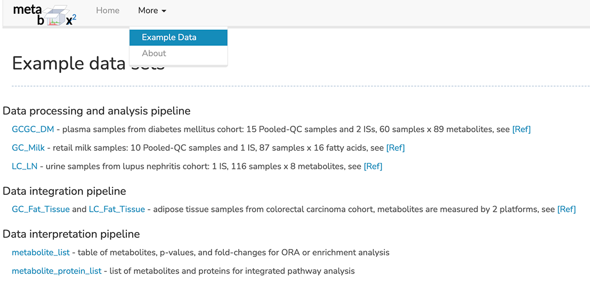<br>
  <em>Figure 2. How to access example datasets</em>
</p>
')
```

## Module 1-DATA PROCESSING

**Step:** Open the GUI → Click the ***DATA PROCESSING (1)*** button → Upload the data → Start the data processing steps

For this tutorial, download the ***GCGC_DM dataset*** (GCGC_DM_Samples.csv) from the provided Example Data (**Figure 2**) and save it to your working directory. This tutorial walks through all steps: missing value imputation, normalization, transformation, and scaling.

**Table 2**. Summary of normalization, transformation, and scaling in metabolomics.

```{r, echo=FALSE}
knitr::kable(
  data.frame(
    Step = c("Normalization", "Transformation", "Scaling"),
    Purpose = c("Remove technical bias", "Improve data distribution", "Balance variable importance"),
    Correction = c("Injection variation, batch effects",
                   "Skewness, heteroscedasticity",
                   "Dominance of high-intensity metabolites"),
    Methods = c("IS-, QC-based, median/TIC",
                "Log, square root, cube root",
                "Pareto scaling, autoscaling, range scaling")
  )
)
```

**Note:** In practice, not all steps are required; the choice depends on the data. Users are encouraged to examine their data first.

### ***1. Upload and setup input data***

When uploading the data, specify the required arguments to setup the Metabox object (**Figure 3**):

  - *Upload a csv file*: Browse to the input data file. → GCGC_DM_Samples.csv
  - *Sample ID column*: Select the sample ID column. → Sample
  - *Class/response column (Y)*: Select the category (factor) column. → SampleGroup
  - *1st variable/feature column (X)*: Select the first variable/feature column. → IS_D3-Alanine

```{r, echo=FALSE, results='asis'}
cat('
<p align="center">
  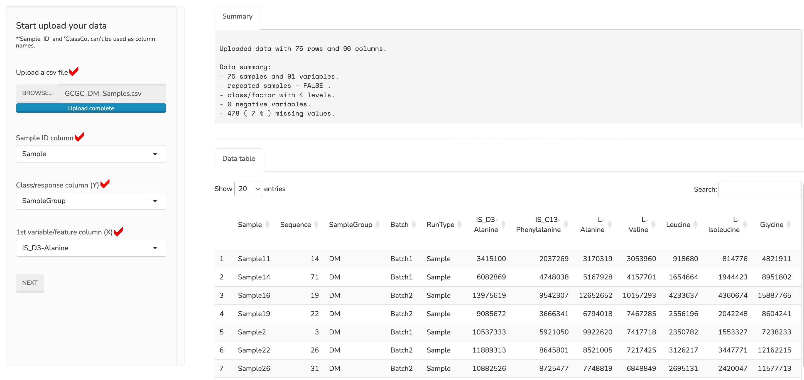<br>
  <em>Figure 3. Setup Metabox object</em>
</p>
')
```

**Output:** See the ***Summary*** tab for an overview of the dataset: 75 samples across four groups, 91 metabolites, and 7% missing values.

### ***2. Missing value imputation***

This step replaces missing values using information from the existing data.

Specify the required arguments to impute missing data (**Figure 4**):

  - *Remove all variables with missing values*: Select whether variables with any missing values are removed or retained. → Not remove all
  - *Remove variables with missing values > (%)*: Enter percentage threshold for missing values, Variables exceeding the cutoff are removed. → 30%
  - *Choose imputation method*: Select missing value imputation method. → RF

```{r, echo=FALSE, results='asis'}
cat('
<p align="center">
  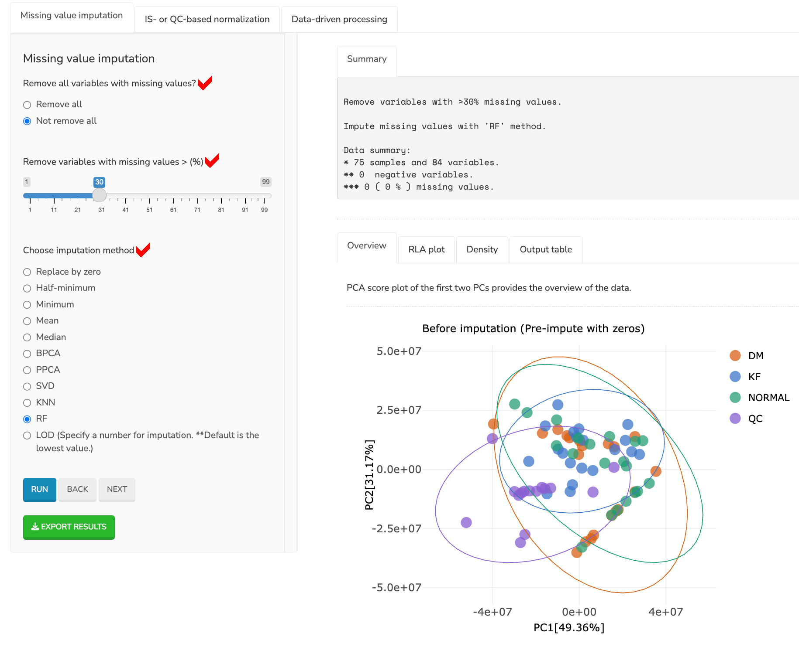<br>
  <em>Figure 4. Missing value imputation</em>
</p>
')
```

**Output:** See the ***Summary*** tab for an overview of the processed dataset. Several plots are provided to compare the dataset before and after imputation. Try other methods or cutoff values if preferred.

Optional: To export the imputed data, click ***EXPORT RESULTS***

### ***3. Normalization***

This step corrects technical variation using known reference compounds, quality control (QC) samples, or statistical assumptions about the dataset.

#### Try IS-based normalization with CCMN method

Specify the required arguments to normalize data (**Figure 5**):

  - *Choose normalization method*: Select normalization method. → ccmn
  - *Class/factor column*: Select the category (factor) column. → SampleGroup
  - *Internal standard column(s)*: Select the internal standard(s) (IS). → IS_D3-Alanine, IS_C13-Phenylalanine
  
The following arguments are for the '*serrf*' method:

  - *sampleType column (require at least 3 QCs)*: Select the sample type column.
  - *injectionOrder column*: Select the injection (run) order column.
  - *batch column*: Select the batch column.
  
```{r, echo=FALSE, results='asis'}
cat('
<p align="center">
  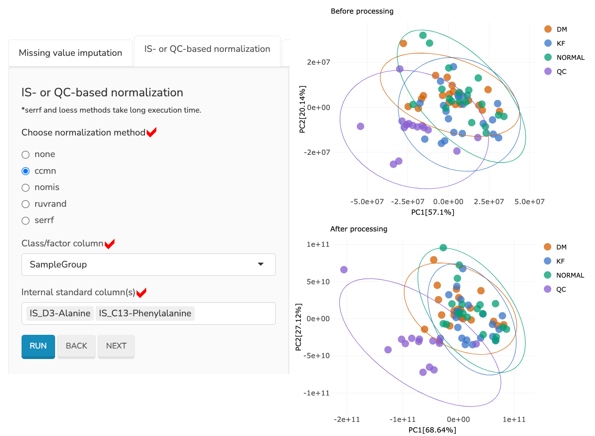<br>
  <em>Figure 5. CCMN normalization</em>
</p>
')
```

**Tip:** Try other methods if preferred. In this demo dataset, the QC samples help indicate how much technical variance is handled.

### ***4. Transformation and scaling***

Under ***Data-driven processing*** tab (**Figure 6**), users can perform sample-based normalization, transformation, or scaling. 

Sample-based normalization corrects unwanted variation based on statistical assumptions about the dataset. Transformation changes the distribution of the data, while scaling adjusts the relative importance of variables (features) so that metabolites with large values do not dominate the analysis, particularly in multivariate analyses.

For this tutorial, a log2 transformation is performed before proceeding to the next modules.
  
```{r, echo=FALSE, results='asis'}
cat('
<p align="center">
  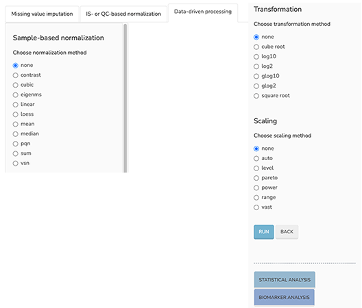<br>
  <em>Figure 6. Data-driven processing</em>
</p>
')
```

**Tip:** Users can proceed to  ***STATISTICAL ANALYSIS*** or  ***BIOMARKER ANALYSIS*** from this page, or export the processed data for other downstream analyses.

## Module 2-STATISTICAL ANALYSIS

After completing data processing, click ***STATISTICAL ANALYSIS*** button to proceed.

**Tip1:** Users can access this module directly by Click the ***STATISTICAL ANALYSIS (2)*** button on the homepage. In this case the step will be: Open the GUI → Click the ***STATISTICAL ANALYSIS (2)*** button → Upload the data → Start the data analysis steps

**Tip2:** Use the tabs to perform univariate analysis, multivariate analysis, correlation analysis, or linear mixed-effects modeling.

### ***Univariate analysis***

Choose ***Univariate analysis*** tab, then perform the analysis.

**Table 3**. Summary of univariate statistical methods in Metabox 2.0.

```{r, echo=FALSE}
df <- data.frame(
  Type = c("Parametric", "Non-parametric"),
  Pairwise_Independent = c("t.test", "wilcox.test/mann-whitney"),
  Pairwise_Repeated = c("t.test (paired)", "wilcox.test (paired)"),
  ANOVA_Independent = c("ANOVA -> posthoc.test",
                        "kruskal.test -> dunn.test or Scheirer Ray Hare.test -> wilcox.test (2W-ANOVA)"),
  ANOVA_Repeated = c("ANOVA -> pairwise.t.test",
                     "friedman.test -> dunn.test"),
  Correlation = c("Pearson", "Spearman"),
  `Linear Modeling` = c("Linear mixed-effect", "N/A")
)
colnames(df) <- c("Type","Independent","Repeated","Independent", "Repeated","Correlation","Linear Modeling")
knitr::kable(df, align = "c") %>%
  add_header_above(c(" " = 1,"Pairwise" = 2,"ANOVA" = 2," " = 2)) %>% kable_styling(full_width = FALSE)
```
**Tip:** Metabox automatically determines the test methods based on the provided arguments.

Specify the required arguments for univariate analysis (**Figure 7**):

  - *Equal variance*: Select whether to assume equal variances between groups. → yes
  - *Parametric test*: Select whether to perform a parametric test. → yes
  - *2nd factor column (for 2-way ANOVA)*: Select second factor column. This parameter is used for two-way ANOVA. → None
  - *Post hoc test (for 1-way and 2-way ANOVA)*: Select whether to perform post hoc tests for one-way and two-way ANOVA. → yes

```{r, echo=FALSE, results='asis'}
cat('
<p align="center">
  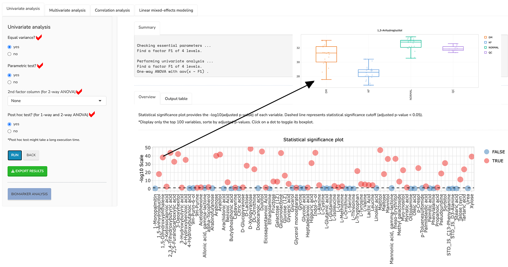<br>
  <em>Figure 7. Univariate analysis</em>
</p>
')
```

**Output1:** Statistical significance plot provides the -log10(adjusted p-value) of each variable. Dashed line represents statistical significance cutoff (adjusted p-value < 0.05). This plot displays only the top 100 variables, sorted by adjusted p-values. Click on a dot to toggle its boxplot.

**Output2:** See the ***Output table*** tab for statistical values. If a post hoc test is performed, a list of significant pairs will be displayed.

### ***Multivariate analysis***

Choose ***Multivariate analysis*** tab, then perform PLS-DA.

Specify the required arguments for multivariate analysis (**Figure 8**):

  - *Choose analysis method*: Select whether to assume equal variances between groups. → PLS
  - *Choose scaling method, if data wasn't processed*: Select whether to perform a parametric test. → None

```{r, echo=FALSE, results='asis'}
cat('
<p align="center">
  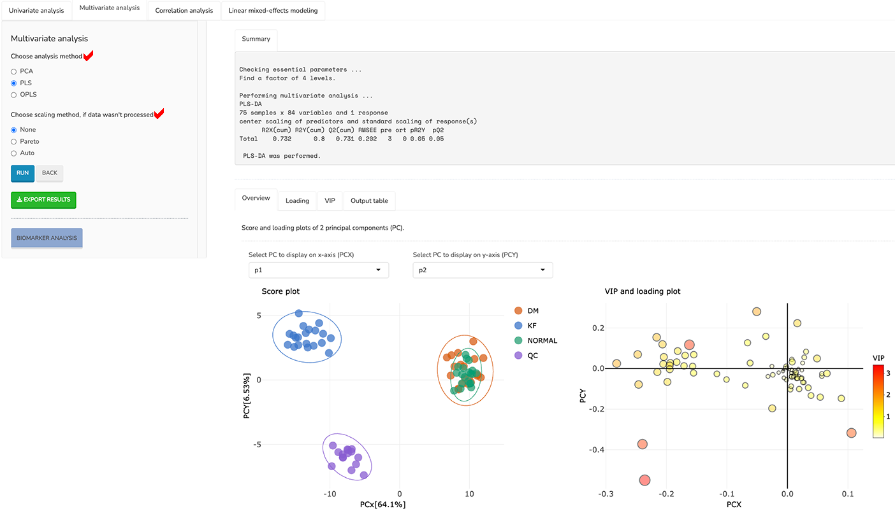<br>
  <em>Figure 8. PLS-DA</em>
</p>
')
```

**Output:** Several plots are provided, including score plot, loading plot, and VIP plot, along with a table of results.

## Module 3-BIOMARKER ANALYSIS

**Step:** Open the GUI → Click the ***BIOMARKER ANALYSIS (3)*** button → Upload the data → Start the analysis

For this tutorial, download the ***LC_LN dataset*** (LC_LN_Samples.csv) from the provided Example Data (**Figure 2**) and save it to your working directory. This tutorial assumes the data is already processed. The dataset contains 116 samples across two groups and 9 metabolites.

Specify the required arguments for biomarker analysis (**Figure 9**):

  - *Choose ML analysis method*: Select ML method. → PLS
  - *Number of repetitions*: Enter number of double cross-validation repetitions. → 3
  - *Ratio of variables included in inner loop iterations (max = 1)*: Enter proportion of variables in inner loops. → 0.75
  - *Ratio of training set (max = 1)*: Enter proportion of data for training. → 0.7
  - *Choose analysis task*: Select whether to perform classification or regression. → Classification
  - *Choose performance evaluation method*: Select evaluation metric. → AUROC

```{r, echo=FALSE, results='asis'}
cat('
<p align="center">
  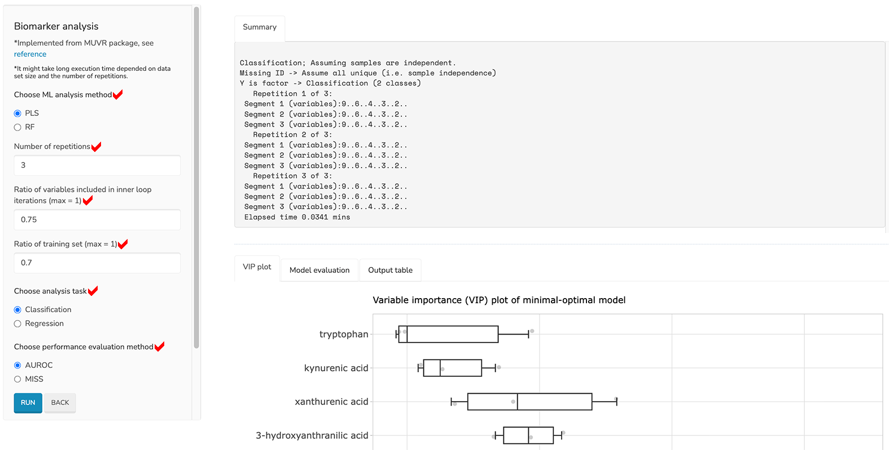<br>
  <em>Figure 9. Biomarker analysis</em>
</p>
')
```

**Output:** Several plots are provided, including variable importance plot, performance plot, along with a table of results.

## Module 4-INTEGRATIVE ANALYSIS

**Step:** Open the GUI → Click the ***INTEGRATIVE ANALYSIS (4)*** button → Upload the data → Start the analysis

For this tutorial, download the ***LC_Fat_Tissue dataset*** (LC_Fat_Tissue.csv) and the ***GC_Fat_Tissue dataset*** (GC_Fat_Tissue.csv) from the provided Example Data (**Figure 2**), and save them to your working directory. Integrative analysis requires at least two datasets from the same subjects measured on different platforms. Each dataset contains 94 samples, including 24 LC metabolites and 137 GC metabolites.

#### ***1. Upload the data***

For each dataset specify the required arguments for uploading the datasets (**Figure 10**):

  - *Number of data sets*: Select the number of datasets (maximum of five). → 2
  - *Upload a csv file of data set 1*: Browse to the input data1 file. → LC_Fat_Tissue.csv
  - *Data set name*: Enter a name for the dataset. The default is the file name. → LC_Fat_Tissue
  - *Sample ID column*: Select the sample ID column. → SampleID
  - *Class/response column (Y)*: Select the category (factor) column. → Tissue
  - *1st variable/feature column (X)*: Select the first variable/feature column. → Cer (d34:1)

```{r, echo=FALSE, results='asis'}
cat('
<p align="center">
  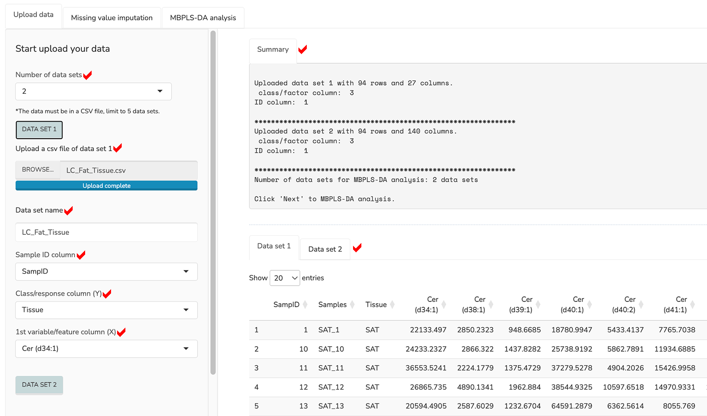<br>
  <em>Figure 10. Setup data for integrative analysis</em>
</p>
')
```

#### ***2. Perform the analysis***

Specify the required arguments for integrative analysis (**Figure 11**):

  - *Maximum number of scanned principle components*: Enter number of principal components. → 5
  - *Optimal number of principle components*: Enter optimal number of components. → 2
  - *Number of bootstrap replications*: Enter number of bootstrap replications. → 5
  - *Number of cross-validation repetitions*: Enter number of cross-validation repetitions. → 3
  - *Perform model components testing and permutation*: Select whether to perform model component testing and permutation. → Yes
  - *Number of permutations*: Enter number of permutations. → 5
  - *Prediction threshold (max = 1)*: Enter numeric value between 0 and 1 indicating the prediction threshold. → 0.5

```{r, echo=FALSE, results='asis'}
cat('
<p align="center">
  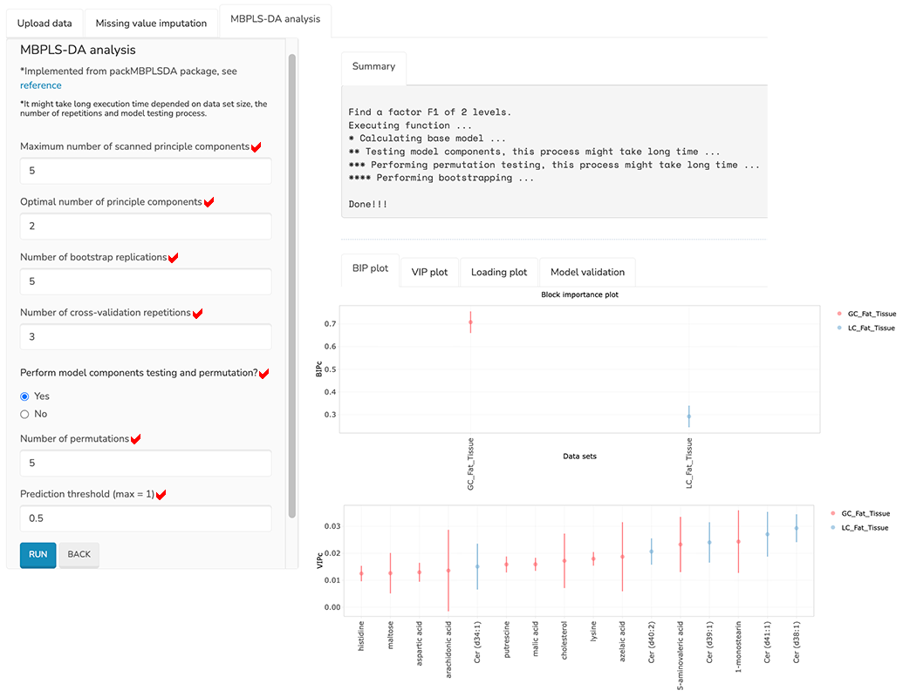<br>
  <em>Figure 11. Integrative analysis</em>
</p>
')
```

**Output:** Several plots are provided, including block importance plot, variable importance plot, loading plot, validation plot.

## Module 5-DATA INTERPRETATION

**Step:** Open the GUI → Click the ***DATA INTERPRETATION (5)*** button → Upload the data → Start the analysis

Metabox 2.0 provides data interpretation in a pathway context for genes, proteins, and metabolites, as well as chemical class context for metabolites.

For this tutorial, download the ***metabolite_list dataset*** (metabolite_list.csv) from the provided Example Data (**Figure 2**), and save them to your working directory. It is assumed that users already have a list of metabolites and associated statistical information, as shown in the demo dataset.

### ***Overrepresentation analysis (ORA)***

For this tutorial, pathway overrepresentation analysis will be performed on a given list of metabolites using the KEGG database as the pathway resource.

Navigate to ***Overrepresentation*** tab and specify the required arguments for overrepresentation analysis (**Figure 12**):

  - *Enter list of variables or Upload a csv file*: Enter list of feature IDs. For pathway analysis uses KEGG IDs (e.g., C12078) for compounds, UniProt entries (e.g., P0C9J6) for proteins, and NCBI Gene IDs (e.g., 10327) for genes. For chemical class analysis uses HMDB IDs (e.g., HMDB0000001) for compounds. Or upload a csv file containing list of features. → metabolite_list.csv
  - *Choose variable type*: Select node type. → Compound
  - *Choose annotation type*: Select set type. → KEGG pathway
  - *Minimum number of members*: Enter minimum number of members per term. → 3

**Tip:** In case of chemical class overrepresentation analysis, it is performed using the HMDB database as the metabolite resource.

```{r, echo=FALSE, results='asis'}
cat('
<p align="center">
  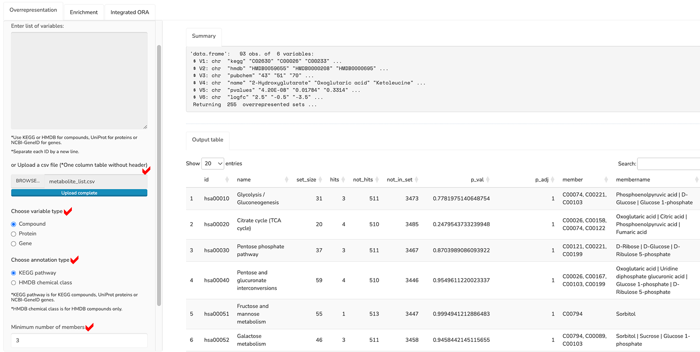<br>
  <em>Figure 12. Overrepresentation analysis</em>
</p>
')
```

**Output:** The results table contains statistical values for each pathway, along with the list of pathway members.

### ***Pathway enrichment analysis***

Pathway enrichment analysis will be performed on a given list of metabolites, incorporating statistical values (e.g., p-, t-, or F-values) and optional directionality (e.g., fold changes), using the KEGG database as the pathway resource.

Navigate to ***Enrichment*** tab and specify the required arguments for enrichment analysis (**Figure 13**):

  - *Upload a csv file*: Upload a csv file containing feature IDs, statistics (e.g., p-, t-, or F-values), and optional directions (e.g., fold changes). → metabolite_list.csv
  - *P-value column*: Select the column containing statistical values. → pvalues
  - *Fold-change column (optional)*: Select the column containing direction values (if none, directionality is ignored). → logfc
  - *Choose analysis method*: Select enrichment method. → Reporter
  - *Choose variable type*: Select node type. → Compound
  - *Choose annotation type*: Select set type. → KEGG pathway
  - *Minimum number of members*: Enter minimum number of members per term. → 3
  
```{r, echo=FALSE, results='asis'}
cat('
<p align="center">
  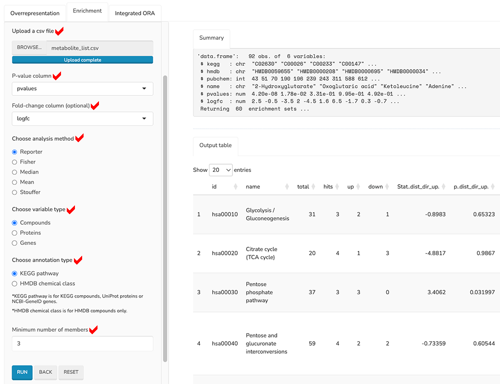<br>
  <em>Figure 13. Enrichment analysis</em>
</p>
')
```

**Output:** The results table contains statistical values for each pathway, along with the list of pathway members.
